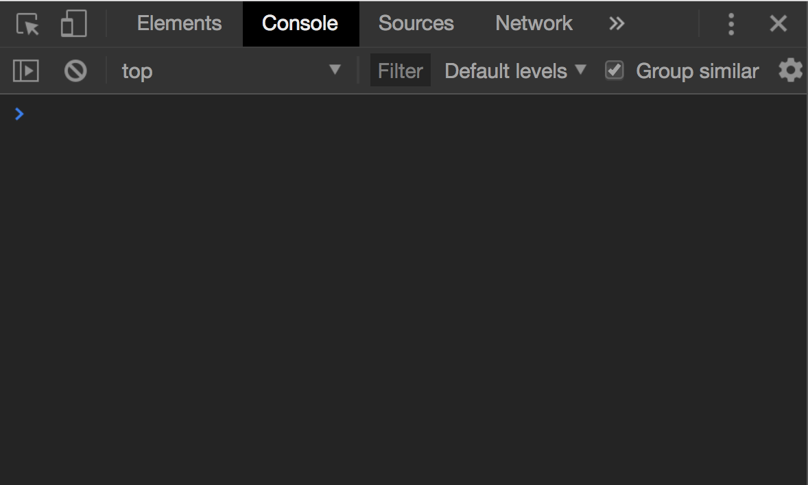

# The Browser is your friend

Modern browsers have come a long way since Netscape Navigator,
along with performance, and usability has come significant leaps
in development quality of life.

## The Console

The console offers a powerful tool to debug and manage
JavaScript execution in the browser.

On most browsers, you can access console output, by opening
browser devtools. It'll look something like this on `Chrome`.



For the most basic type of debugging, you can use:

```js
console.log('some debug string...');
```

.. In your JavaScript code
to figure out what's being executed, when and
where. This is akin to print debugging, but the console
is considerably more powerful.

But we can also write directly into the browser's console,
to get live output on our frontend's states.

Try typing `window` for example, in the console, and
you'll see the console spit out the window object.

In fact, _anything_ that is reachable from the global
state can be inspected, live, within the console.

### DevTools

To really harness this power we can go a step further,
and add breakpoints to our code and then live inspect
application state, at a designated timeslice.

More on this [here](https://developers.google.com/web/tools/chrome-devtools/javascript/breakpoints).

All of these may seem like overkill, but debugging
JavaScript can often be quite difficult; remember,
JavaScript is dynamically typed, and asynchronous.
Print debugging can be unreliable and confusing.

Getting familiar with the browser debugger will
save you future unnecessary headaches.
